<p align="center">
  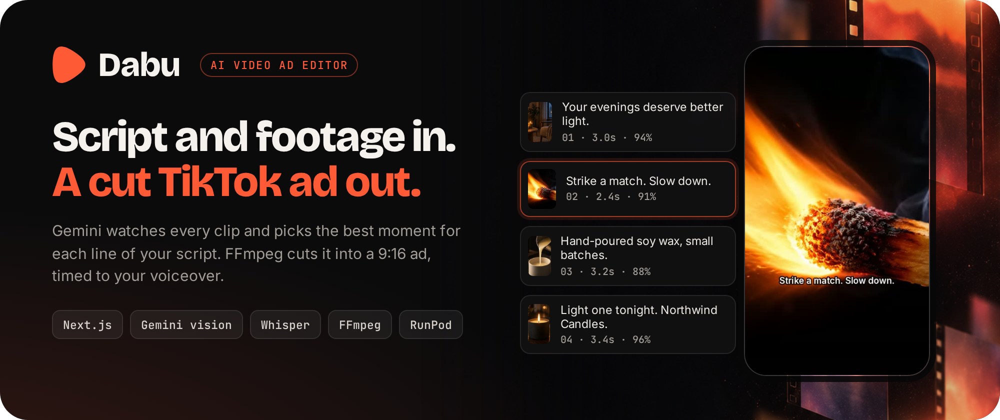
</p>

<p align="center">
  <a href="#quick-start"><b>Quick start</b></a> ·
  <a href="#the-studios">Studios</a> ·
  <a href="#how-it-works">How it works</a> ·
  <a href="#configuration">Configuration</a> ·
  <a href="https://harrythentrepreneur.github.io/dabu-studio/">Website</a> ·
  <a href="docs/OVERVIEW.md">Docs</a>
</p>

<p align="center">
  
  
  
  
  
  
</p>

---

**Dabu turns an ad script and a folder of raw clips into a cut vertical ad.**
Gemini watches every clip and picks the best few seconds for each line of the
script. If you add a voiceover, Whisper times each cut to your words. A GPU
worker then cuts, merges and exports a 1080×1920 video you can post or open in
CapCut.

Editing a short ad is mostly searching. You scrub twenty minutes of footage to
find the two seconds that match "and it actually works". Dabu gives that search
to a vision model, and you keep the creative call.

<p align="center">
  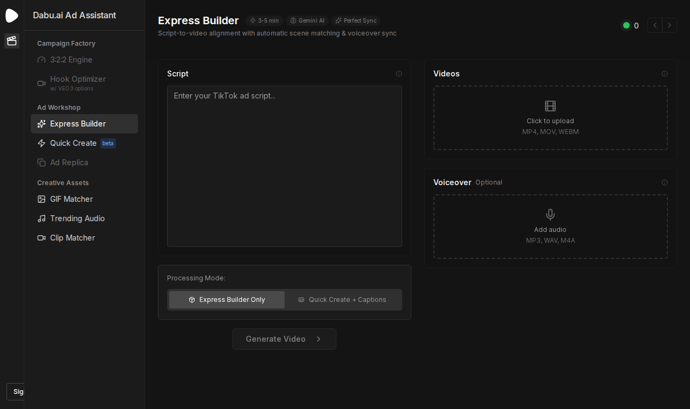
  <br><sub>The real Dabu frontend, recorded headless. The brand (Northwind Candles), the AI-generated clips and the backend replies are demo data.</sub>
</p>

## The studios

<p align="center">
  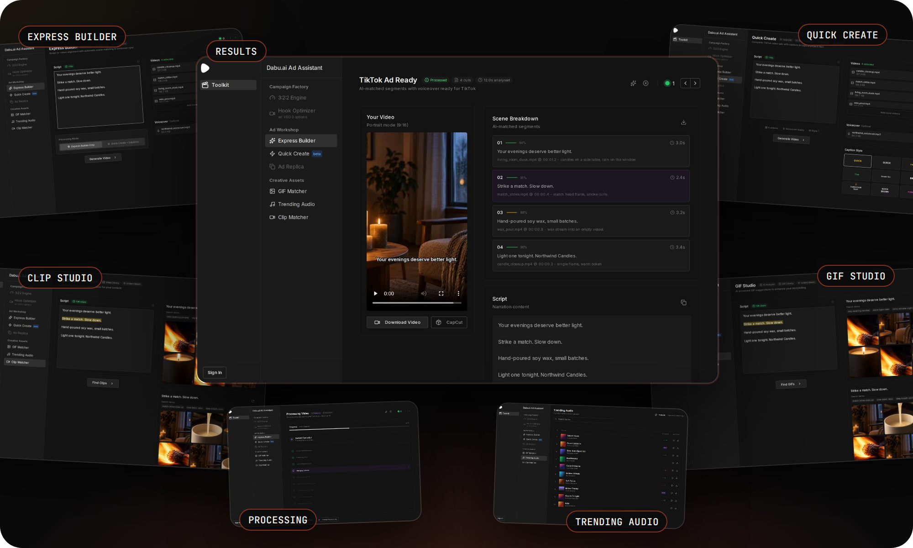
</p>

| Studio | What it does |
| --- | --- |
| **Express Builder** | Script + clips (+ optional voiceover) in, a finished ad with hard cuts out, matched line by line |
| **Quick Create** | Express Builder plus burned-in captions in a style you pick |
| **Clip Studio** | Splits your script into moments and searches stock clips for each one |
| **GIF Studio** | Finds GIF overlays for each line by mood |
| **Trending Audio** | Browse and preview music tracks for the ad |

<table>
  <tr>
    <td width="50%">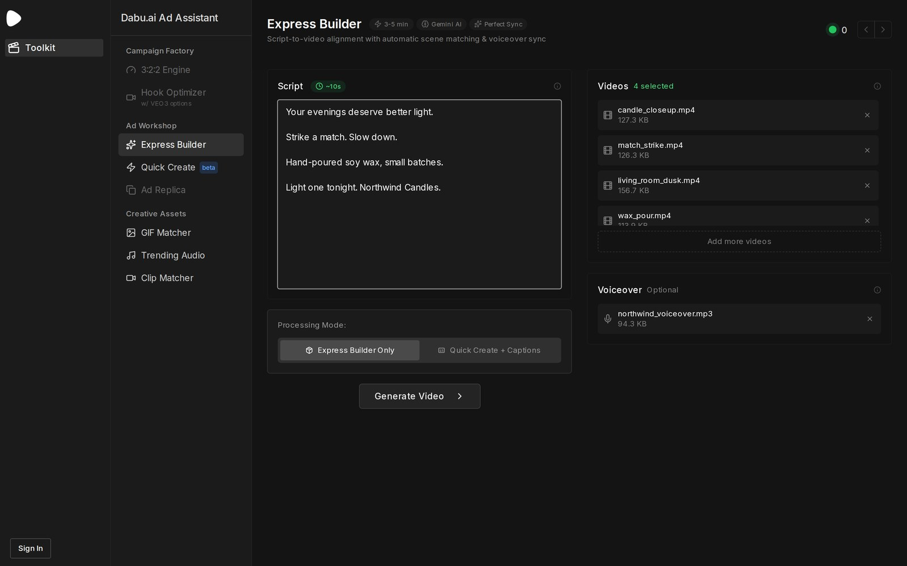<br><sub><b>Express Builder.</b> Paste the script, drop the clips, add a voiceover if you have one.</sub></td>
    <td width="50%">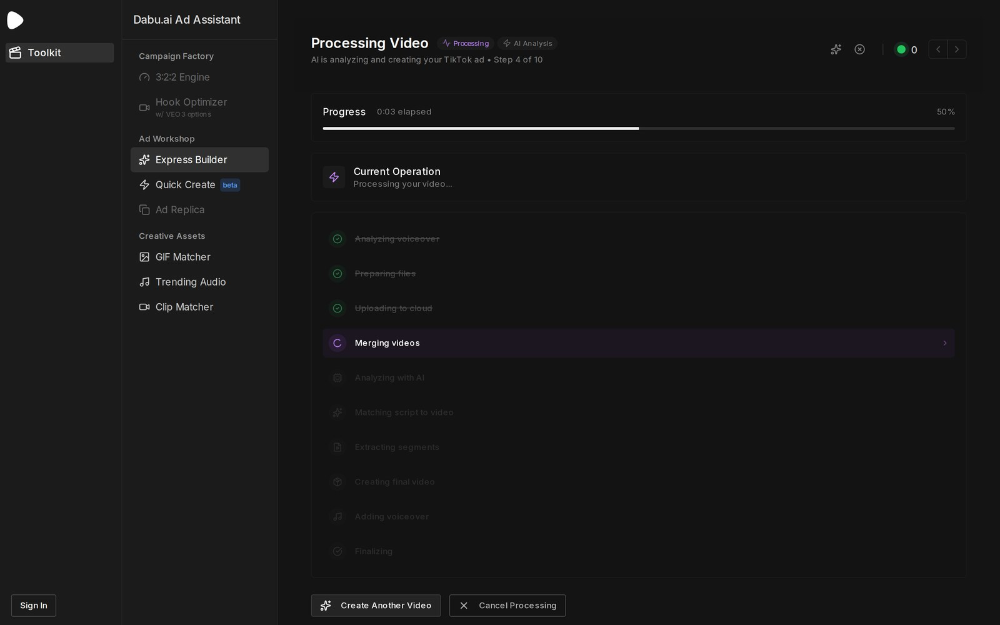<br><sub><b>Processing.</b> Live progress from the worker, step by step.</sub></td>
  </tr>
  <tr>
    <td width="50%">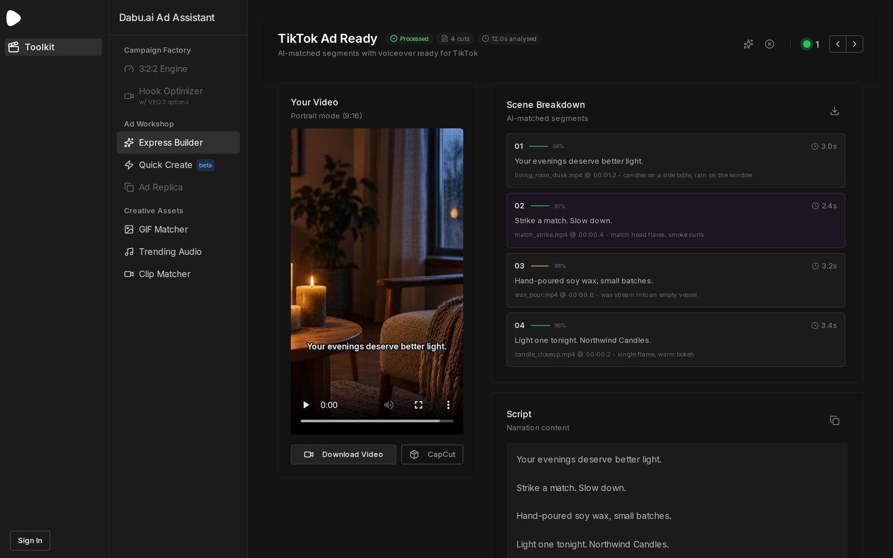<br><sub><b>Results.</b> The cut ad, every scene with its match score, and the script. Download or open in CapCut.</sub></td>
    <td width="50%">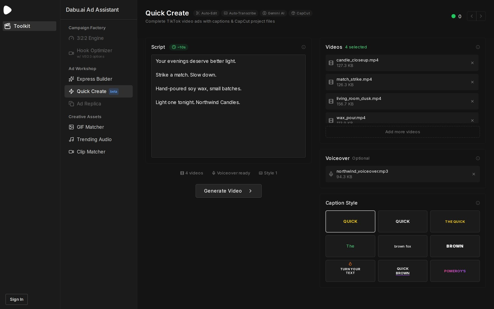<br><sub><b>Quick Create.</b> The same flow with a caption style picker.</sub></td>
  </tr>
  <tr>
    <td width="50%">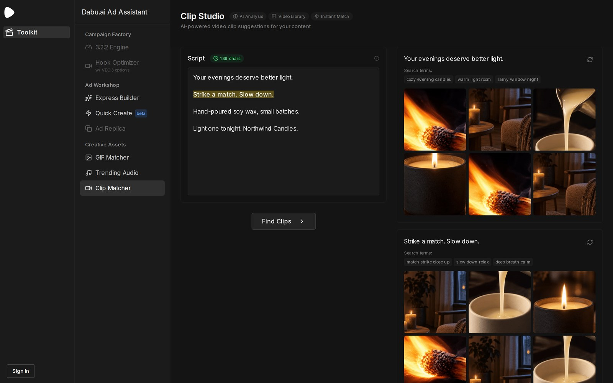<br><sub><b>Clip Studio.</b> Stock moments for each line of the script.</sub></td>
    <td width="50%">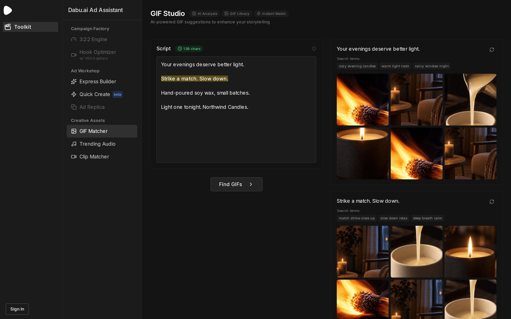<br><sub><b>GIF Studio.</b> Overlays matched to each line.</sub></td>
  </tr>
  <tr>
    <td width="50%">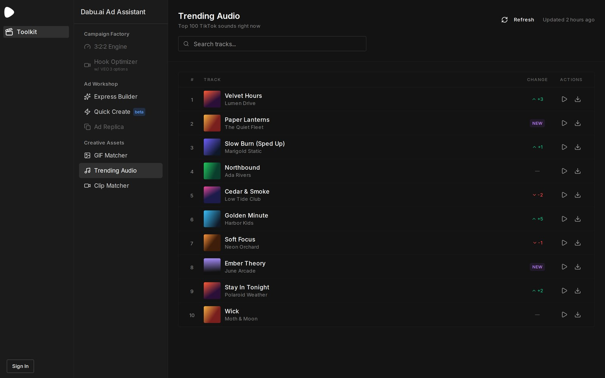<br><sub><b>Trending Audio.</b> Track list with previews. Names in this screenshot are demo data.</sub></td>
    <td width="50%"></td>
  </tr>
</table>

## How it works

<p align="center">
  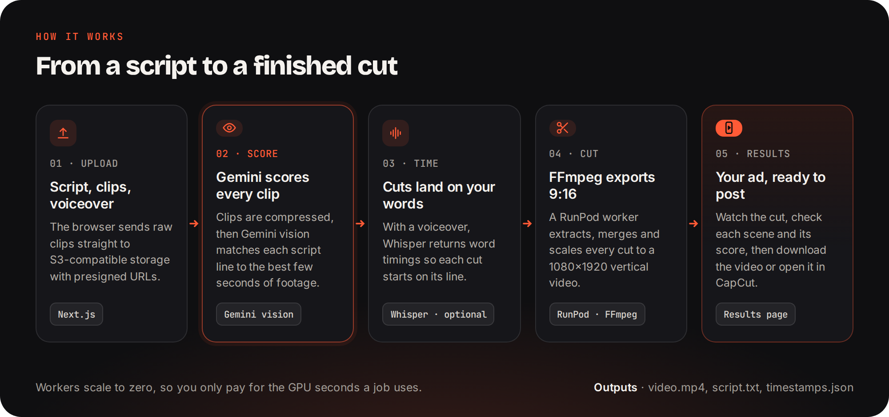
</p>

1. **Upload.** The browser sends raw clips straight to S3-compatible storage
   (DigitalOcean Spaces by default) with presigned URLs, so large files never
   pass through the Next.js server.
2. **Score.** The worker compresses the clips for analysis, then Gemini vision
   matches each script line to the best few seconds of footage and returns a
   confidence score and a short reason for each pick.
3. **Time.** With a voiceover, Whisper returns word timings so each cut starts
   on the line it belongs to. Without one, Gemini fits the cuts to a target
   length (30 seconds by default).
4. **Cut.** FFmpeg on a RunPod serverless worker extracts each moment, scales
   it to 1080×1920 and merges the cuts into one vertical video.
5. **Results.** The app shows the video, the scene breakdown and the script.
   The worker also writes `script.txt` and `timestamps.json` next to the video.

RunPod workers scale to zero, so you pay only for the GPU seconds a job uses.

## Quick start

You need Node 20+, Python 3.11+, FFmpeg, and keys for Gemini and Clerk. Storage
and RunPod are needed for the full pipeline.

```bash
git clone https://github.com/harrythentrepreneur/dabu-studio.git
cd dabu-studio

# frontend
cd frontend
cp .env.example .env.local      # fill in Clerk, Spaces, RunPod, Gemini keys
npm install --legacy-peer-deps
npm run dev                     # http://localhost:3000

# backend worker (local test server)
cd ../backend
cp .env.example .env
pip install -r requirements.txt
python test_server.py
```

To deploy the worker on RunPod, see
[`docs/deployment/RUNPOD_DEPLOYMENT.md`](docs/deployment/RUNPOD_DEPLOYMENT.md).
The frontend runs anywhere Next.js runs.

## Configuration

| Variable | Where | Used for |
| --- | --- | --- |
| `GEMINI_API_KEY` | frontend, backend | Clip analysis and script matching |
| `OPENAI_API_KEY` | frontend, backend | Whisper voiceover timing (optional) |
| `DO_SPACES_KEY`, `DO_SPACES_SECRET`, `DO_SPACES_BUCKET`, `DO_SPACES_REGION`, `DO_SPACES_ENDPOINT` | frontend, backend | Video storage (any S3-compatible bucket) |
| `RUNPOD_API_KEY`, `RUNPOD_ENDPOINT_ID` | frontend | Serverless GPU worker |
| `NEXT_PUBLIC_CLERK_PUBLISHABLE_KEY`, `CLERK_SECRET_KEY` | frontend | Sign-in. The frontend will not start without a Clerk key |
| `NEXT_PUBLIC_KLIPY_API_KEY`, `GIPHY_API_KEY` | frontend | Clip and GIF search |
| `STRIPE_SECRET_KEY`, `NEXT_PUBLIC_STRIPE_PUBLISHABLE_KEY`, `STRIPE_WEBHOOK_SECRET` | frontend | Optional billing |
| `USE_RUNPOD`, `TARGET_DURATION_DEFAULT`, `MAX_VIDEO_SIZE_MB`, `WHISPER_*` | backend | Worker tuning |

The full lists, with comments, are in
[`frontend/.env.example`](frontend/.env.example) and
[`backend/.env.example`](backend/.env.example).

## Repository

```
frontend/      Next.js app: studios, upload, results, auth, billing
backend/       Python worker: Gemini analysis, Whisper, FFmpeg pipeline, RunPod handlers
docs/          overview, architecture, API, quick start, deployment guides, website
scripts/       deploy and validation helpers
```

## Status

Dabu was built as a product and is now shared as-is. The Express Builder
pipeline runs end to end. Expect rough edges:

- The sidebar links to a few studios that were never finished (3:2:2 Engine,
  Hook Optimizer, Ad Replica). Those routes are not in this repository.
- Some docs were written along the way and may describe older setups.
- There are no automated tests for the full pipeline.

Issues and pull requests are welcome.

## Credits

Built by [Harry Edwards](https://github.com/harrythentrepreneur) and
Kaviru Hapuarachchi.

Parts of the frontend shell are adapted from
[Rybbit](https://github.com/rybbit-io/rybbit), which is licensed AGPL-3.0. See
[NOTICE](NOTICE) for the list of files.

## Licence

[AGPL-3.0](LICENSE). Dabu includes AGPL-licensed code, so the whole project is
AGPL-3.0. If you run a modified version as a network service, you must offer
its source to its users.
