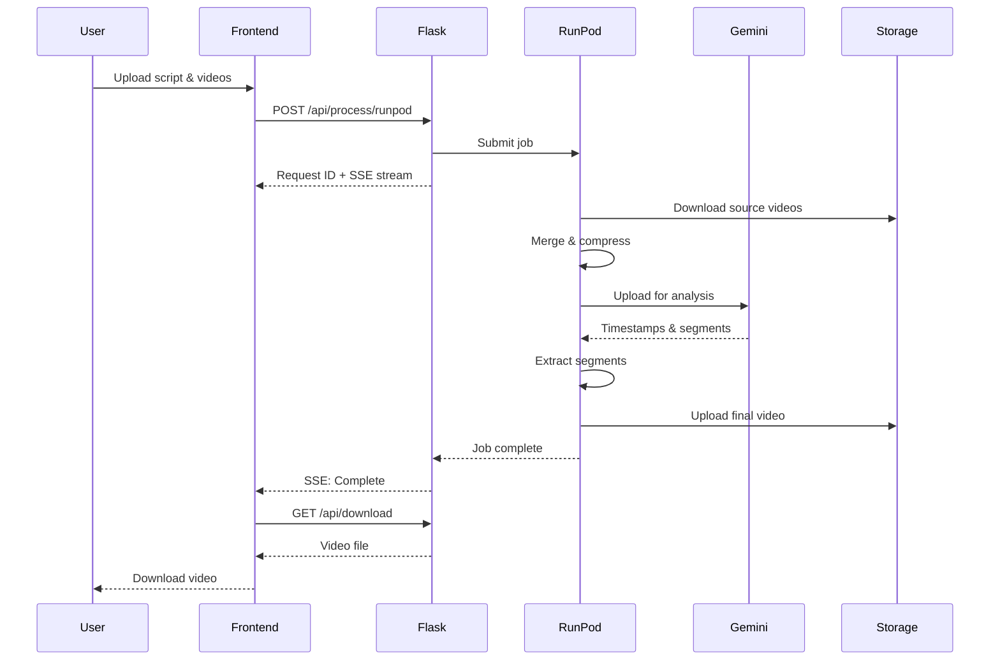
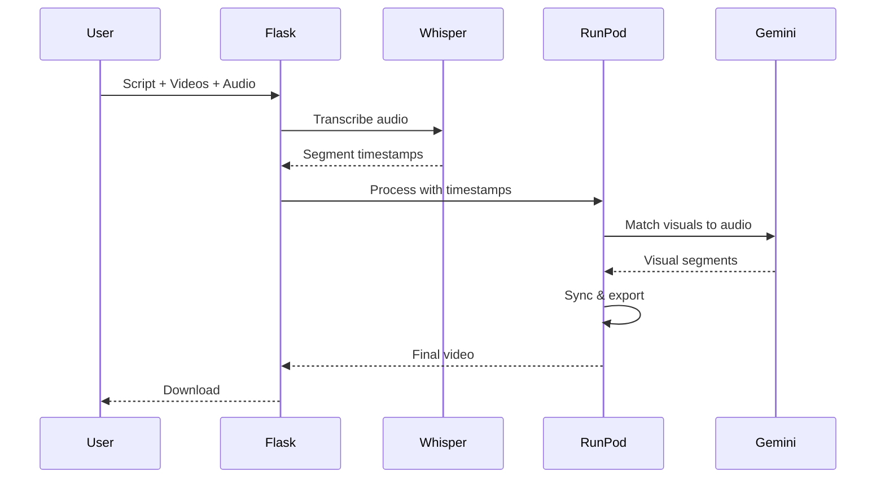

# Architecture Documentation

## System Architecture Overview

The TikTok Video Ad Automation system follows a microservices architecture with clear separation of concerns between lightweight orchestration and heavy processing.

```
┌──────────────────────────────────────────────────────────────────────┐
│                           Client Layer                               │
├──────────────────────┬───────────────────────────────────────────────┤
│   Main Frontend      │            Extended Toolkit                   │
│   (Next.js 15)       │            (Next.js 15.4.6)                  │
│   - Video Processing │            - Express Builder                 │
│   - Script Input     │            - Clip Studio                     │
│   - Progress Monitor │            - GIF Studio                      │
└──────────────────────┴───────────────────────────────────────────────┘
                                       │
                                       ▼
┌──────────────────────────────────────────────────────────────────────┐
│                    Flask API Gateway (Lightweight)                   │
│  - Request Routing      - Authentication       - Rate Limiting       │
│  - Job Orchestration    - SSE Streaming       - Caching             │
│  - Webhook Management   - Error Handling      - Logging             │
└──────────────────────────────────────────────────────────────────────┘
           │                    │                    │
           ▼                    ▼                    ▼
┌──────────────────┐ ┌──────────────────┐ ┌──────────────────┐
│   RunPod Workers │ │    Redis Cache   │ │  Digital Ocean   │
│   (Serverless)   │ │    (SSE/State)   │ │     Spaces       │
│                  │ │                  │ │   (Large Files)  │
│  - FFmpeg        │ │  - Job Status    │ │                  │
│  - Gemini API    │ │  - SSE Events    │ │  - Video Storage │
│  - Whisper API   │ │  - Session Data  │ │  - Backup Files  │
│  - GPU Accel.    │ │  - Rate Limits   │ │  - CDN Delivery  │
└──────────────────┘ └──────────────────┘ └──────────────────┘
```

## Component Details

### 1. Frontend Applications

#### Main Application (`/app`)
- **Framework**: Next.js 15 with App Router
- **UI Library**: shadcn/ui components
- **Styling**: Tailwind CSS
- **State Management**: React hooks + Context API
- **Key Features**:
  - Real-time SSE progress updates
  - Drag-and-drop file upload
  - Script validation
  - Video preview

#### Extended Toolkit (`/frontend`)
- **Framework**: Next.js 15.4.6
- **React Version**: 19.1.0
- **Key Modules**:
  - Express Builder: Template-based creation
  - Clip Studio: Advanced editing
  - GIF Studio: Moment extraction

### 2. Flask API Gateway

#### Core Responsibilities
```python
# Lightweight orchestration layer (~50MB Docker image)
- Request validation and routing
- RunPod job submission
- SSE event streaming
- Result caching
- Error handling
```

#### Key Modules

**Request Handler** (`api/request_handlers.py`):
- Input validation
- File upload handling
- Request ID generation
- Response formatting

**RunPod Client** (`runpod_client/client.py`):
- Job submission
- Status polling
- Result retrieval
- Error recovery

**Status Emitter** (`api/status_emitter.py`):
- SSE connection management
- Real-time progress updates
- Event queuing
- Client heartbeat

### 3. RunPod Serverless Workers

#### Worker Architecture
```python
# Heavy processing container with GPU support
- NVIDIA CUDA base image
- FFmpeg with hardware acceleration
- Python ML libraries
- Gemini API integration
```

#### Processing Pipeline
1. **Job Receipt**: Handler receives job from RunPod queue
2. **Resource Allocation**: GPU/CPU resources assigned
3. **Processing**: Execute video operations
4. **Upload**: Store results to cloud storage
5. **Callback**: Notify Flask API of completion

#### Task Types
- `merge_videos`: Concatenate multiple videos
- `compress_video`: Optimize for Gemini API
- `extract_segments`: Cut specific timestamps
- `add_voiceover`: Mux audio track
- `full_pipeline`: Complete processing workflow

### 4. Data Flow

#### Standard Processing Flow


#### Voiceover Processing Flow


## Deployment Architecture

### Development Environment
```yaml
# docker-compose.yml structure
services:
  flask-api:       # Port 5000
  redis:           # Port 6379
  frontend-main:   # Port 3000
  frontend-toolkit:# Port 3002
  nginx:           # Port 80/443
```

### Production Deployment

#### Recommended Stack
1. **Flask API**: Railway/Render ($5-20/month)
2. **RunPod Workers**: Serverless ($0.00011/sec)
3. **Frontend**: Vercel (free tier)
4. **Redis**: Upstash (free tier)
5. **Storage**: DO Spaces ($5/month)

#### Infrastructure as Code
```terraform
# Example Terraform configuration
resource "railway_project" "api" {
  name = "tiktok-video-api"
}

resource "runpod_endpoint" "worker" {
  name           = "video-processor"
  docker_image   = "user/video-processor:latest"
  gpu_type       = "T4"
  min_workers    = 0
  max_workers    = 5
  idle_timeout   = 5
}

resource "vercel_project" "frontend" {
  name = "tiktok-video-frontend"
  framework = "nextjs"
}
```

## Scaling Strategy

### Horizontal Scaling

#### Flask API
- Multiple instances behind load balancer
- Sticky sessions for SSE connections
- Shared Redis for state

#### RunPod Workers
- Auto-scale 0-N workers
- Queue-based distribution
- GPU type selection per workload

### Vertical Scaling

#### GPU Tiers
```
T4 (Budget):      $0.00011/sec - Most tasks
RTX 3090 (Fast):  $0.00044/sec - Heavy processing
A100 (Premium):   $0.00189/sec - Batch processing
```

### Caching Strategy

#### Multi-Level Cache
1. **Browser Cache**: Static assets (1 year)
2. **CDN Cache**: Processed videos (24 hours)
3. **Redis Cache**: API responses (5 minutes)
4. **Storage Cache**: Gemini uploads (1 hour)

## Security Architecture

### API Security
```python
# Implemented security measures
- API key authentication
- Rate limiting per IP/key
- Input validation
- SQL injection prevention
- XSS protection
- CORS configuration
```

### Data Security
- Encrypted storage (AES-256)
- HTTPS only communication
- Temporary file cleanup
- No credential logging
- Environment variable isolation

### RunPod Security
- Isolated containers
- No persistent storage
- API key rotation
- Webhook signatures
- Network isolation

## Performance Optimization

### Video Processing
```python
# Optimization techniques
1. Two-tier processing:
   - Compressed for AI analysis (480p)
   - Full quality for extraction (1080p)

2. Parallel operations:
   - Concurrent segment extraction
   - Batch file uploads
   - Async API calls

3. Smart compression:
   - Adaptive bitrate
   - Hardware encoding (NVENC)
   - Format optimization
```

### API Performance
```python
# Response time targets
GET  /health:        <50ms
POST /process:       <200ms (async)
GET  /status:        <100ms
GET  /download:      <500ms (redirect)
SSE  /status-stream: <20ms latency
```

## Monitoring & Observability

### Metrics Collection
```python
# Key metrics to track
- Request rate
- Processing time
- Error rate
- GPU utilization
- Queue depth
- Cost per request
```

### Logging Strategy
```python
# Structured logging
logger.info("Processing started", extra={
    "request_id": request_id,
    "script_length": len(script),
    "video_count": len(videos),
    "target_duration": duration
})
```

### Health Checks
```python
# Multi-point health monitoring
/api/health           # Flask API
/api/runpod/health    # RunPod connection
/api/redis/ping       # Redis connection
/api/storage/health   # Storage access
```

## Disaster Recovery

### Backup Strategy
1. **Code**: Git repositories (GitHub)
2. **Data**: DO Spaces with versioning
3. **Config**: Encrypted env backups
4. **Database**: Redis snapshots

### Failure Recovery
```python
# Automatic recovery mechanisms
1. RunPod job retry (3 attempts)
2. Gemini fallback to smaller model
3. Storage fallback to local disk
4. SSE reconnection (exponential backoff)
```

## Cost Analysis

### Per-Request Cost Breakdown
```
T4 GPU (30s):        $0.0033
Gemini API:          $0.0001
Storage (100MB):     $0.0001
Bandwidth (100MB):   $0.0010
Flask hosting:       $0.0001
--------------------------
Total per video:     $0.0046 (~$0.005)
```

### Monthly Cost Projection
```
100 videos/day:   $15/month
500 videos/day:   $75/month
1000 videos/day:  $150/month
```

## Development Workflow

### CI/CD Pipeline
```yaml
# GitHub Actions workflow
1. Code push to main
2. Run tests (pytest, jest)
3. Build Docker images
4. Push to registry
5. Deploy to staging
6. Run E2E tests
7. Deploy to production
8. Monitor metrics
```

### Testing Strategy
```
Unit Tests:        Core logic validation
Integration Tests: API endpoint testing
E2E Tests:         Full workflow validation
Load Tests:        Performance benchmarks
Chaos Tests:       Failure recovery
```

## Future Architecture Considerations

### Planned Improvements
1. **GraphQL API**: Better client flexibility
2. **WebSocket**: Replace SSE for bidirectional
3. **Edge Functions**: Reduce latency globally
4. **ML Pipeline**: Custom model training
5. **Kubernetes**: Container orchestration

### Scalability Roadmap
```
Phase 1: Current (100 videos/day)
Phase 2: Redis Cluster (1,000 videos/day)
Phase 3: Multi-region (10,000 videos/day)
Phase 4: Custom hardware (100,000 videos/day)
```

---

This architecture is designed for maintainability, scalability, and cost-effectiveness while providing a smooth user experience.